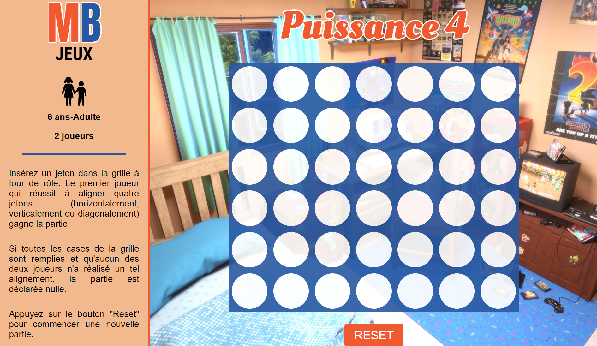

# Connect4-React

This project is an implementation of the well-known 'Connect 4' game.

## Table of Contents

- [Demo](#demo)
- [Stack](#stack)
- [Screenshot](#screenshot)
- [Main features](#main-features)
- [Game rules](#game-rules)
- [Run the project locally](#run-the-project-locally)
- [Getting started with Vite](#getting-started-with-vite)
- [Contributing](#contributing)
- [Stay Updated](#stay-updated)
- [Contact](#contact)

## Demo

You can play the game [here](https://jesselessa.github.io/connect4-react).

## Stack

This project has been created with React using Vite.

It uses Class components (before React 16.8, it was the only way to track state and lifecycle on a React component).

## Screenshot

## Main features

- Automatic detection of each player's turn.
- Automatic detection of a victory or a stalemate (draw).
- Reset of the grid to start a new game.
- Background music.

## Game Rules

- First, decide which player goes first (player 1 has the red tokens, player 2, the yellow ones). Players must alternate turns.
- On your turn, drop one of your colored tokens from the top into any of the seven slots.
- The game ends when there are four tokens lined up in a row (either horizontally, vertically, or diagonally) or a stalemate.
- Click on the 'Reset' button to start a new game.
- The starter of the previous game goes second on the next game.

## Run the project locally

1. Open your terminal and navigate to the location where you want the local repository to be copied.
2. Clone the repository : `git clone https://github.com/jesselessa/connect4-react.git`
3. Navigate to the project directory : `cd connect4-react`
4. Install dependencies required in the project : `npm install`
5. Run the application in development mode : `npm start`
6. Open http://localhost:3000 in your preferred browser to view the development server.

## Getting Started with Vite

[Vite](https://vitejs.dev/) is a fast development tool for modern web applications. To get started with Vite, follow these simple steps :

### 1. Install Node.js and npm

Ensure you have Node.js and npm installed on your system. You can download and install them from the [official Node.js website](https://nodejs.org/en).

### 2. Initialize the project

If you have not already created a project, you can initialize a new project using the following command in your terminal : `npm init vite@latest my-project --template react`.

This command will create a new directory named `my-project` and install a Vite project with a React template in it.

### 3. Install dependencies

Once the project is initialized, navigate to the newly created directory (`cd my-project`) and install the dependencies by running the command `npm install`.

### 4. Start the development server

To start the development server, use the command `npm run dev`.

This will launch Vite and automatically open your default browser to http://localhost:5173, where you can see your live application.

### 5. Deploy to production

To build an optimized version of your application ready for production, use the command `npm run build`.

This will generate a production-ready version of your application in the `dist` directory of your project.

## Contributing

- If you are interested in contributing, explore the project structure in the 'src' folder and modules installed in the 'package.json' file.
- Feel free to make improvements, fix bugs, or suggest new features.

## Stay updated

To stay updated with the project latest changes, you can pull them from the repository : `git pull origin main`

## Contact

For inquiries, contact me via [LinkedIn](https://www.linkedin.com/in/jesselessa/).

---

&copy; 2024, Jessica ELESSA - All rights reserved
